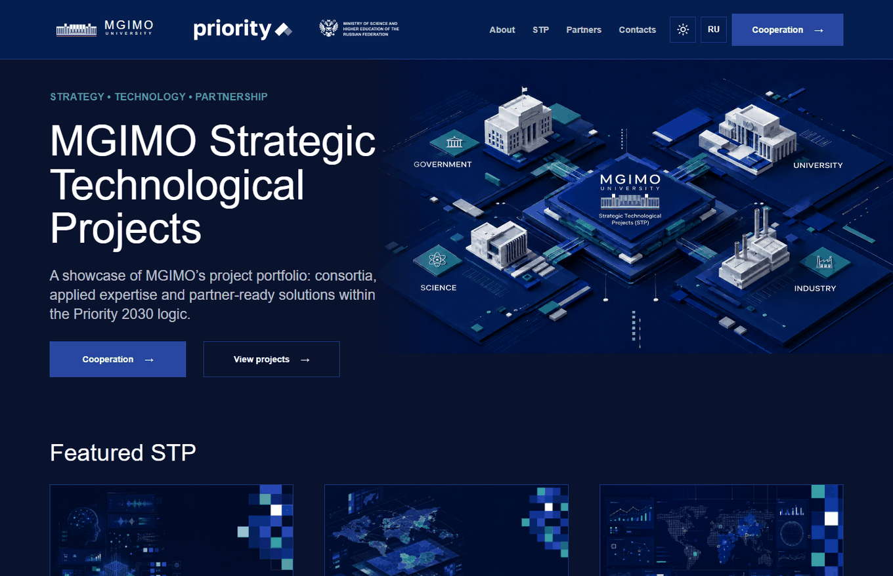
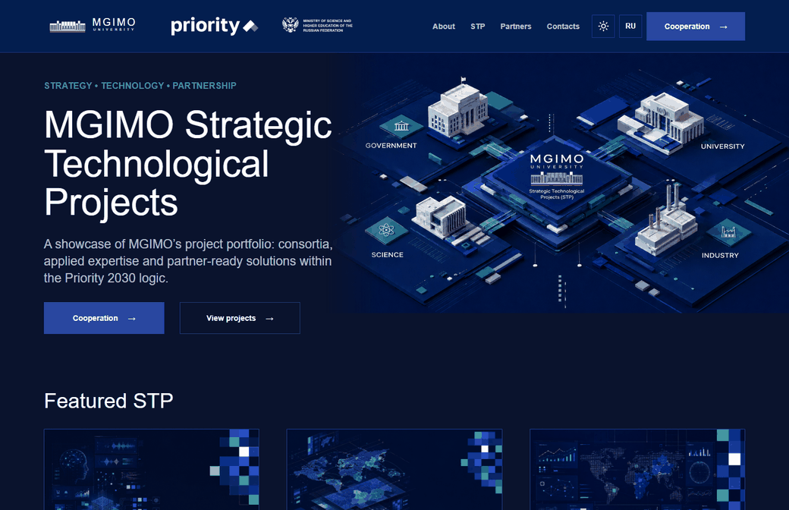
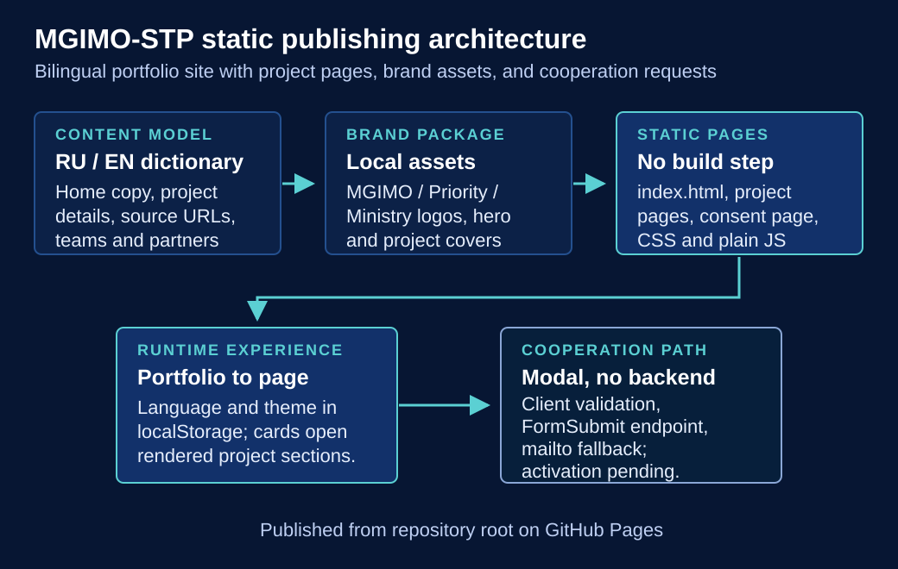
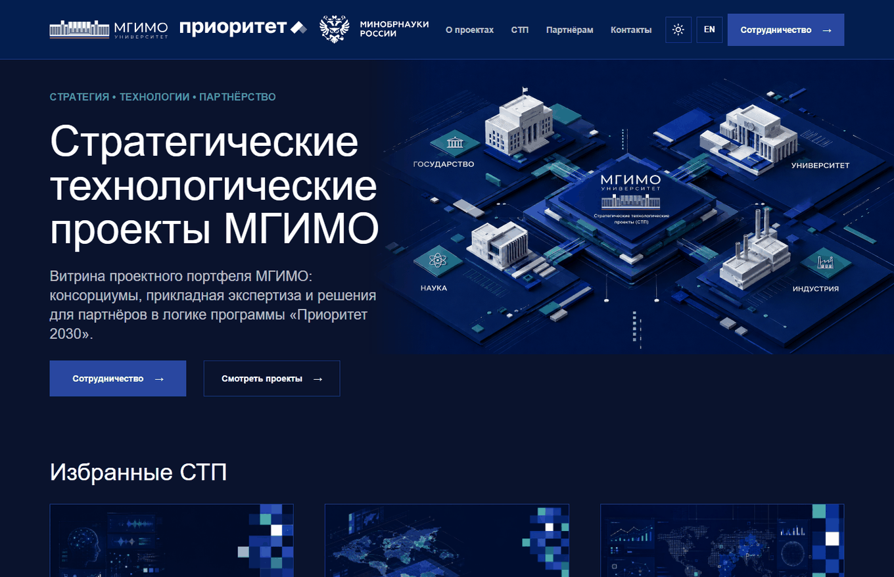
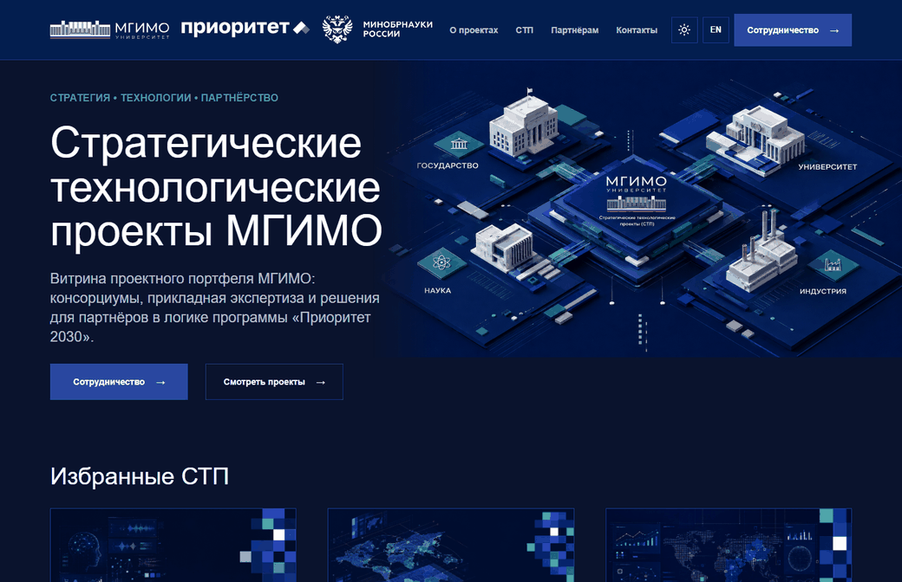
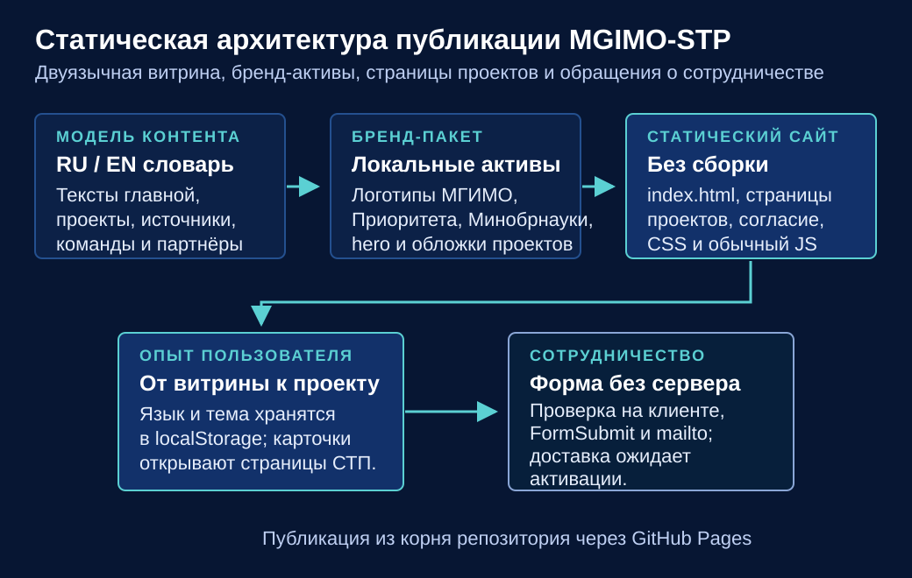

<a id="english"></a>

# MGIMO Strategic Technological Projects

[English](#english) · [Русский](#russian) · [Live site](https://arseniy24rus.github.io/MGIMO-STP/)



MGIMO-STP is a bilingual static portfolio site for MGIMO's Strategic Technological Projects. It presents the university's project portfolio, consortium logic, partner audiences, project pages and a cooperation contact path within the Priority 2030 context. The audience is practical: potential partners, university teams, public-sector stakeholders, businesses and reviewers who need a concise project showcase rather than a CMS or operational project-management system.

The site supports real Russian and English UI states. Language is selected from the header, stored in `localStorage`, and applied through the dictionary in [app.js](app.js). Theme switching is handled the same way. The home page in [index.html](index.html) exposes the main navigation, hero, featured STP cards, partnership model, audience blocks, activity blocks, cooperation call-to-action and contact section with a Leaflet map. The project pages [project-neiro.html](project-neiro.html), [project-atlas.html](project-atlas.html) and [project-digital-systems.html](project-digital-systems.html) are static shells that [app.js](app.js) fills with localized project content; [project-enhancements.js](project-enhancements.js) then enriches them with passports, team cards, workstream cards and partner/site previews.



_Demo: the English UI moves from the portfolio to the MGIMO Atlases page and opens the cooperation dialog; no form submission is made._

## Scenario and capabilities

A typical visitor lands on the portfolio, switches language or theme if needed, reviews the three featured STP cards, opens a project page and scans the project passport, description, team, results and partners. If the visitor wants to continue, the cooperation button opens a modal form with project selection, required contact fields, consent text and a link to [personal-data-consent.html](personal-data-consent.html). This README and the demo deliberately stop before submission. The form endpoint is configured in [app.js](app.js) through FormSubmit for `project_office@inno.mgimo.ru`, but delivery must be treated as pending until an authorized MGIMO mailbox confirmation is completed. The consent notice also requires final MGIMO legal approval before public promotion of the form.

The project is source-driven but not database-driven. Content lives in JavaScript dictionaries rather than a headless CMS. Each project includes a `sourceUrl` pointing to the corresponding public Priority 2030 project page inside [app.js](app.js). Visual identity comes from the included brand package under [Brandbook MGIMO STP/](Brandbook%20MGIMO%20STP/), especially the release manifest [Brandbook MGIMO STP/docs/release_manifest.json](Brandbook%20MGIMO%20STP/docs/release_manifest.json) and package notes [Brandbook MGIMO STP/docs/README_состав_комплекта.txt](Brandbook%20MGIMO%20STP/docs/README_%D1%81%D0%BE%D1%81%D1%82%D0%B0%D0%B2_%D0%BA%D0%BE%D0%BC%D0%BF%D0%BB%D0%B5%D0%BA%D1%82%D0%B0.txt). The site uses local logos, project covers, project graphics, team portraits, partner logos, Lucide static icons and bundled Leaflet assets so the core presentation can run from GitHub Pages without a build step.



_Architecture: localized dictionaries and brand assets feed static pages, project rendering and the cooperation request path._

## Architecture and constraints

This repository is plain HTML/CSS/JavaScript. There is no `package.json`, bundler, framework runtime, server function or deployment build pipeline. GitHub Pages serves the repository root; [.nojekyll](.nojekyll) keeps asset paths available as-is. The runtime reads the user's language and theme preference from local storage, changes image sources for RU/EN and light/dark variants, renders project cards, renders project pages, initializes the contact map and wires the cooperation dialog.

The main limitation follows from that architecture: all content changes require editing source files. There is no editorial admin, no server validation, no analytics pipeline and no stored submissions in this repository. The contact map depends on external map tiles, so the fallback text is important when network access or third-party tiles fail. The cooperation form depends on FormSubmit and mailbox activation, so the site should not be described as having confirmed production delivery until that activation has been completed.

## Run and verify

Because the site is static, it can be opened directly, but a local HTTP server is closer to GitHub Pages:

```bash
python -m http.server 4175
```

Then open `http://127.0.0.1:4175/`. There are no existing automated test scripts in the repository. The relevant smoke checks are browser-based: load the home page in Russian and English, toggle theme, open each project page, confirm project content renders, open the cooperation dialog without submitting it, open the consent page and verify that the contact map either loads tiles or shows its fallback. Do not submit test data through the cooperation form.

## Deployment, licensing and attribution

The live site is published from the root of the `main` branch at [arseniy24rus.github.io/MGIMO-STP](https://arseniy24rus.github.io/MGIMO-STP/). No root `LICENSE` file is present, so do not assume the site code, brand package or media are open-source licensed. Brand assets for MGIMO, Priority 2030 and the Ministry of Science and Higher Education should be used only according to the included brand materials and institutional approvals. Leaflet is bundled under the BSD 2-Clause license in [assets/vendor/leaflet/LICENSE](assets/vendor/leaflet/LICENSE). Local Lucide icons are documented in [assets/icons/lucide/README.md](assets/icons/lucide/README.md) and licensed through [assets/icons/lucide/LICENSE-lucide-static.txt](assets/icons/lucide/LICENSE-lucide-static.txt). The map layer includes OpenStreetMap and CARTO attribution in [app.js](app.js).

<a id="russian"></a>

# Стратегические технологические проекты МГИМО

[English](#english) · [Русский](#russian) · [Живой сайт](https://arseniy24rus.github.io/MGIMO-STP/)



MGIMO-STP — двуязычный статический сайт-портфолио стратегических технологических проектов МГИМО. Он показывает проектный портфель университета, консорциумную логику, аудитории партнёров, страницы проектов и путь обращения в проектный офис в контексте программы «Приоритет 2030». Это не CMS и не система управления проектами, а аккуратная публичная витрина для потенциальных партнёров, университетских команд, государственных заказчиков, бизнеса и рецензентов.

В приложении действительно реализованы русская и английская версии интерфейса. Язык выбирается в шапке, сохраняется в `localStorage` и применяется через словарь в [app.js](app.js). Там же устроено переключение темы. Главная страница [index.html](index.html) содержит навигацию, hero, карточки избранных СТП, модель партнёрства, блоки аудиторий и активностей, CTA сотрудничества и контакты с картой Leaflet. Страницы [project-neiro.html](project-neiro.html), [project-atlas.html](project-atlas.html) и [project-digital-systems.html](project-digital-systems.html) являются статическими оболочками: [app.js](app.js) наполняет их локализованным контентом, а [project-enhancements.js](project-enhancements.js) добавляет паспорта, карточки команды, направления работ и партнёрские превью.



_Демо: русский интерфейс переходит от портфеля к странице «Атласы МГИМО» и открывает форму сотрудничества; отправка формы не выполняется._

## Сценарий и возможности

Типичный посетитель открывает витрину, при необходимости переключает язык или тему, просматривает три карточки СТП, переходит на страницу проекта и изучает паспорт, описание, команду, результаты и партнёров. Если нужен следующий шаг, кнопка «Сотрудничество» открывает модальную форму с выбором проекта, обязательными контактными полями, текстом согласия и ссылкой на [personal-data-consent.html](personal-data-consent.html). Эта README-демонстрация намеренно не отправляет форму. Endpoint настроен в [app.js](app.js) через FormSubmit на `project_office@inno.mgimo.ru`, но доставку нужно считать ожидающей активации, пока уполномоченный сотрудник МГИМО не подтвердит mailbox в FormSubmit. Текст согласия также требует финального юридического одобрения МГИМО перед публичным продвижением формы.

Проект опирается на исходный контент, но не использует базу данных. Материалы хранятся в JavaScript-словарях, а не в headless CMS. У каждого проекта в [app.js](app.js) указан `sourceUrl` на соответствующую публичную страницу Priority 2030. Визуальная система берётся из пакета [Brandbook MGIMO STP/](Brandbook%20MGIMO%20STP/), включая [release_manifest.json](Brandbook%20MGIMO%20STP/docs/release_manifest.json) и описание состава комплекта [README_состав_комплекта.txt](Brandbook%20MGIMO%20STP/docs/README_%D1%81%D0%BE%D1%81%D1%82%D0%B0%D0%B2_%D0%BA%D0%BE%D0%BC%D0%BF%D0%BB%D0%B5%D0%BA%D1%82%D0%B0.txt). Сайт использует локальные логотипы, hero-изображения, обложки проектов, графику, портреты команды, партнёрские логотипы, статические иконки Lucide и включённые файлы Leaflet.



_Архитектура: локализованные словари и бренд-активы питают статические страницы, рендеринг проектов и путь обращения о сотрудничестве._

## Архитектура и ограничения

Репозиторий построен на обычных HTML, CSS и JavaScript. Здесь нет `package.json`, сборщика, серверных функций, фреймворкового runtime или deployment pipeline. GitHub Pages публикует корень репозитория; файл [.nojekyll](.nojekyll) нужен, чтобы статические ресурсы отдавались без обработки Jekyll. Во время работы сайт читает язык и тему из local storage, подменяет RU/EN и light/dark изображения, рендерит карточки проектов, наполняет страницы СТП, инициализирует карту контактов и подключает модальное окно сотрудничества.

Главное ограничение следует из этой архитектуры: любое изменение контента требует правки исходных файлов. В репозитории нет редакторской админки, серверной валидации, аналитического контура и хранения заявок. Контактная карта зависит от внешних тайлов, поэтому fallback-текст важен при сетевых сбоях. Форма зависит от FormSubmit и активации почтового ящика, поэтому сайт нельзя описывать как подтверждённо принимающий production-заявки до завершения этой активации.

## Запуск и проверки

Сайт статический и может открываться напрямую, но локальный HTTP-сервер ближе к условиям GitHub Pages:

```bash
python -m http.server 4175
```

Затем откройте `http://127.0.0.1:4175/`. В репозитории нет существующих автоматических test-скриптов. Практические проверки выполняются в браузере: открыть главную на русском и английском, переключить тему, открыть каждую страницу проекта, убедиться, что материалы проекта появились, открыть форму сотрудничества без отправки, открыть страницу согласия и проверить, что карта контактов загружает тайлы либо показывает fallback. Тестовые данные через форму не отправлять.

## Публикация, лицензии и атрибуция

Живой сайт опубликован из корня ветки `main` на [arseniy24rus.github.io/MGIMO-STP](https://arseniy24rus.github.io/MGIMO-STP/). В корне нет файла `LICENSE`, поэтому нельзя считать код, бренд-пакет или медиа открыто лицензированными. Активы МГИМО, Priority 2030 и Минобрнауки следует использовать только в рамках бренд-материалов и институциональных согласований. Leaflet включён под BSD 2-Clause, см. [assets/vendor/leaflet/LICENSE](assets/vendor/leaflet/LICENSE). Локальные иконки Lucide описаны в [assets/icons/lucide/README.md](assets/icons/lucide/README.md), лицензии — в [assets/icons/lucide/LICENSE-lucide-static.txt](assets/icons/lucide/LICENSE-lucide-static.txt). Атрибуция OpenStreetMap и CARTO для карты указана в [app.js](app.js).
